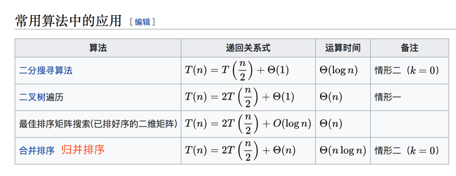
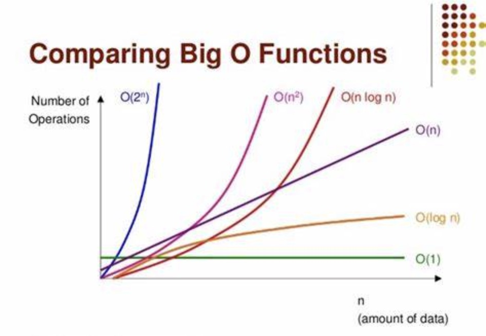
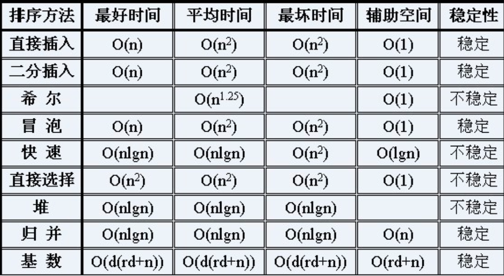

# Algorithm

## 时间复杂度

用于评估执行程序所消耗的时间，可以估算出程序对处理器的使用程度

* O(1)：Constant Complexity 常数复杂度

   ```shell
    // O(1)
    $n=100000;
    echo 'hello';
   ```

* O(n)：Linear ComPlexity 线性时间复杂度
  
   ```shell
    // O(n)
    for($i = 1; $i <= $n; $i++) {
        echo 'hello';
    }
   ```

* O(log n)：Logarithmic ComPlexity 对数复杂度
  
   ```shell
    // O(log n)
    for($i = 1; $i <= $n; $i = $i*2) {
        echo 'hello';
    }
   ```

* O(n^2)：N square ComPlexity 平方
  
   ```shell
    // O(n^2)
    for($i = 1; $i <= $n; $i++) {
        for($j = 1; $j <= $n; $j++) {
            echo 'hello';
        }
    }
   ```

* O(n^3)：N cubic ComPlexity 立方
* O(2^n)：Exponential Growth 指数

   ```shell
    // O(k^2)
    fib($n) {
        if ($n < 2) {
            return $n;
        }
        
        return fib($n-1) + fib($n-2);
    }
   ```

* O(n!)：Factorial 阶乘
  
## [常见算法时间复杂度](https://juejin.cn/post/6844904167824162823)

   
   
   

   **二叉树的遍历-前序、中序、后序：时间复杂度是多少？**
   答案是：O(n)，这里的n代表二叉树里边树的节点的总数，不管是哪种方式遍历，每个节点都有且仅访问一次，所以它的复杂度是线性于二叉树的节点总数，也就是O(n)

   **图的遍历：时间复杂度是多少？**
   答案：O(n)，图中的每一个节点也是有且仅访问一次，因此时间复杂度也是O(n)，n为图中的节点总数

   **搜索算法：DFS(深度优先)、BFS(广度优先)时间复杂度是多少？**
   答案：O(n)，后边的文章会详细介绍这两种算法(n为搜索空间中的节点总数)

   **二分查找：时间复杂度是多少？**
   答案：O(logn)

   **时间复杂度排名**
   算法时间复杂度由小到大依次为：Ο(1)＜Ο(log n)＜Ο(n)＜Ο(nlog n)＜Ο(n2)＜Ο(n3)＜…＜Ο(2^n)＜Ο(n!)

## 空间复杂度

   用于评估执行程序所占用的内存空间，可以估算出程序对计算机内存的使用程度

   空间复杂度和时间复杂度的情况其实类似，但是它更加的简单。用最简单的方式来分析即可。主要有两个原则：

   如果你的代码中开了数组，那么数组的长度基本上就是你的空间复杂度。比如你开了一个一维的数组，那么你的空间复杂度就是O(n)，如果开了一个二维的数组，数组长度是n^2，那么空间复杂度基本上就是n^2

   如果是有递归的话，那么它递归最深的深度，就是你空间复杂度的最大值。如果你的程序里边递归中又开了数组，那么空间复杂度就是两者的最大值
