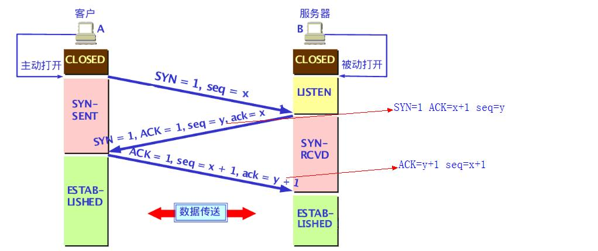

# 网络

## http1.0 / 1.1 / 2.0区别

   | 类别 | http1.0 | http1.1 | http2.0 |
   | ---  | --- | --- | --- |
   | 长链接 | 手动设置keep-alive参数，每次请求都要建立tcp连接，无法复用，降低网络利用率 | 默认支持长连接Connection:keep-alive | 同1.1 |
   | 多路复用 | 前一请求响应后下一个请求才能发送，前一请求阻塞，后面请求也会阻塞，也就是队头阻塞 | 管道化文本传输：不等第一个请求响应继续发送后面请求，但响应顺序还是按照请求顺序响应 | 二进制传输、同一域名下所有的请求从同一tcp连接中走，http消息被分解为独立的帧，乱序发送，服务端根据标识和头部将消息重新组装，响应也是根据标识来响应，无顺序 |
   | 缓存 | -- | 强缓存Cache-Control、协商缓存ETag，有缓存直接取，不发送请求 | 同1.1 |
   | 断点传输 | -- | 默认支持，Range参数 | 同1.1 |
   | 数据压缩 | -- | -- | 使用HPACK算法对header进行压缩，减小体积，使传输更快 |
   | 服务器推送 | -- | -- | 支持 |

## TCP三次握手及四次挥手

   

* 客户端发送SYN (SEQ=x)报文给服务器端，进入SYN_SENT状态。
* 服务器端收到SYN报文，回应一个SYN (SEQ=y)，ACK(ACK=x+1)报文，进入SYN_RCVD状态。
* 客户端收到服务器端的SYN报文，回应一个ACK(ACK=y+1)报文，进入Established状态。

   

* 数据发送完毕后，客户端发送释放连接请求(FIN=1,seq=u）并进入FIN-WAIT-1状态。
* 服务器收到释放连接请求，做出应答( ACK=1,seq=v,ack=u+1.)，并进入CLOSE-WAIT状态。(此时客户端处于FIN-WAIT-2状态   不发送只接收数据，此时仍在接收服务器传输的数据)
* 服务器发送完所有数据后发送释放连接请求(FIN=1,ACK=1,seq=w,ack=u+1)，并进入LAST-ACK状态。
* 客户端收到释放连接请求后发送确认应答(ACK=1,seq=u+1,ack=w+1),并进入TIME-WAIT状态.该状态会持续2MSL(2倍报文最大生存时间)时间（服务器收到应答会立即进入CLOSED状态)，若该时间段内没有收到重发请求,就进入CLOSED状态。

## [https握手](https://github.com/liuhanqu/fe-interview/issues/1)

   
   

* 客户端向服务器发出加密请求
* 服务器响应：服务器收到客户端请求后，检查加密通信协议版本是否一致，如果一致就返回服务器证书，不一致则关闭加密通信
* 客户端回应：客户端收到证书后，检查证书是否有效，如果无效或者失效则给出警示，由访问者决定是否继续连接，如果证书有效则用证书中的公钥加密一个随机数(pre-master key)返回给服务器，同时向服务器端发送握手结束通知
* 服务器最后回应：服务器收到客户端的加密随机数后，计算生成本次会话的“会话密钥”，向客户端发送服务器握手结束通知

## TCP与UDP区别

* 连接方面
  * TCP 面向连接（如打电话要先拨号建立连接）
  * UDP是无连接的，发送数据之前不需要建立连接
* 安全方面
  * TCP 提供可靠的服务，通过TCP连接传送的数据，无差错、不丢失、不重复且按序到达
  * UDP 尽最大努力交付，即不保证可靠交付
* 传输效率
  * TCP 传输效率相对较低
  * UDP传输效率较高，适用于高速传输和实时性有较高的通信或广播通信
* 连接对象数量
  * TCP 只能是点对点，一对一的
  * UDP支持一对一，一对多，多对一和多对多的交互通信
